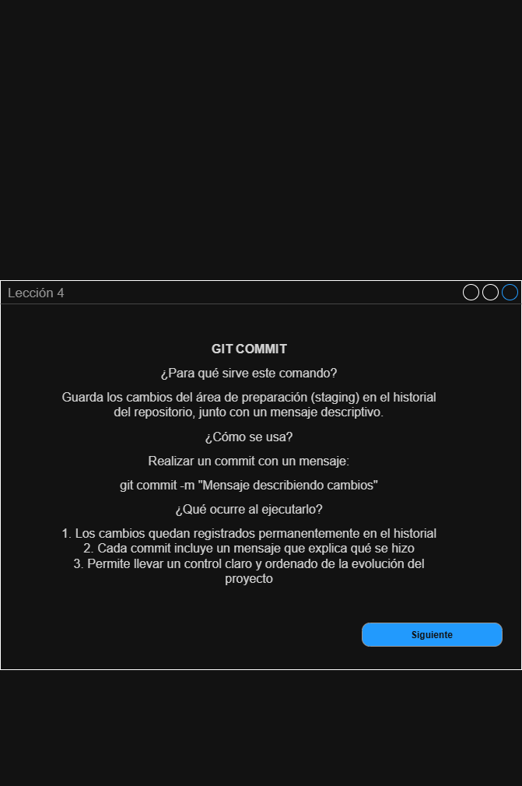

APRENDIENDO GIT-HUB
Objetivo: Crear una aplicación que muestre un curso para que oriente al usuario a hacer el proceso de subir código y a aprender los conceptos básicos de Git.
## Pantalla de inicio

## Pantalla de bienvenida

## Lecciones
### Leccion 1

### Leccion 2

### Leccion 3

### Leccion 4

### Leccion 5

### Leccion 6

### Leccion 7

### Leccion 8

## Evaluaciones (Quiz)
### Quiz 1

### Quiz 2

### Quiz 3

### Quiz 4

### Quiz 5

## Sección 2

## Historias de usuario

